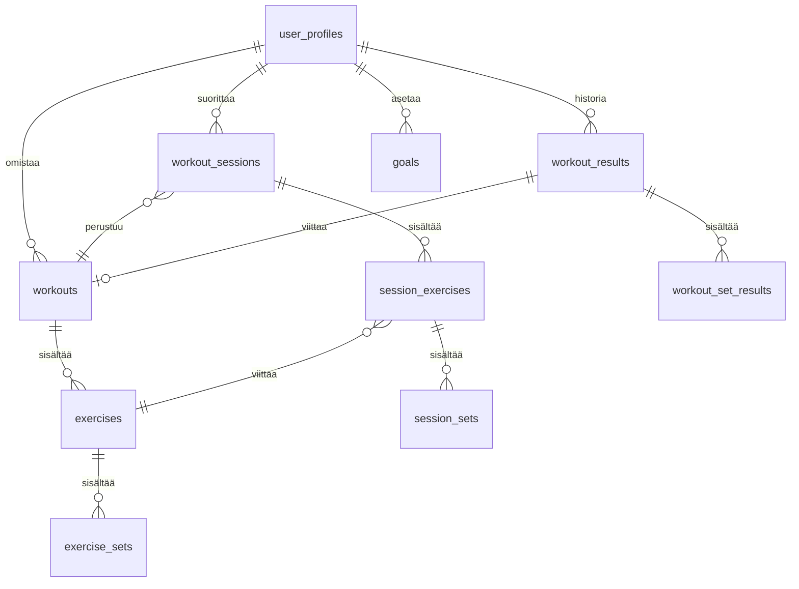

# Database Schema

SportVault käyttää Supabasea (PostgreSQL). Rakenne jakautuu käyttäjäprofiileihin, treenipohjiin, treenihistoriaan ja tavoitteisiin.

## 1. Entity Relationship Diagram (ERD)



## 2. Taulukuvaukset

### Käyttäjät

- **`user_profiles`**: Käyttäjän tiedot (nickname, kokemustaso, pituus, paino, ikä).

### Treenipohjat (Templates)

- **`workouts`**: Treeniohjelman päätaso (nimi, tyyppi, muistiinpanot).
- **`exercises`**: Liikkeet pohjassa (nimi, kategoria, superset_group).
- **`exercise_sets`**: Suunnitellut sarjat (toistot, paino, sarjamäärä, lepoaika).

### Treenitapahtumat (Nykyinen malli)

- **`workout_sessions`**: Suoritettu treenikerta (kesto, fiilis, RPE-keskiarvo, kokonaisvolyymi).
- **`session_exercises`**: Istunnon liikkeet.
- **`session_sets`**: Istunnon sarjatulokset.

### Treenihistoria (Vaihtoehtoinen/Vanha malli)

- **`workout_results`**: Treenin lopputulos (kesto, muistiinpanot JSON-muodossa).
- **`workout_set_results`**: Yksittäiset sarjatulokset historiassa.

### Muut

- **`goals`**: Käyttäjän tavoitteet (tavoitearvo, nykyinen arvo, määräaika, liikkeen nimi).
- **`shared_workouts`**: Linkitykset jaettuihin treeneihin (`share_token`).

## 3. RPC Funktiot

RPC-funktioita käytetään monimutkaisiin transaktioihin:

- **`upsert_workout_with_children`**: Luo tai päivittää treenin, liikkeet ja sarjat kerralla.
  - _Argumentit_: `p_exercises` (JSON-taulukko, joka sisältää liikkeet ja niiden sarjat).
- **`insert_workout_with_children`**: Sama kuin yllä, mutta vain luomiseen.
- **`get_shared_workout`**: Hakee jaetun treenin tiedot tokenilla.

## 4. Turvallisuus ja RLS

- Kaikissa tauluissa on **RLS** päällä.
- Pääsy on rajoitettu käyttäjän omaan dataan: `auth.uid() = user_id`.
- `shared_workouts` on poikkeus, joka sallii julkisen lukemisen tokenilla.

## 5. Esimerkkikysely (Deep Join)

```typescript
// Haetaan koko treenipohja kerralla
const { data } = await supabase
  .from("workouts")
  .select(
    `
    *,
    exercises (
      *,
      exercise_sets (*)
    )
  `,
  )
  .eq("id", workoutId)
  .single();
```
