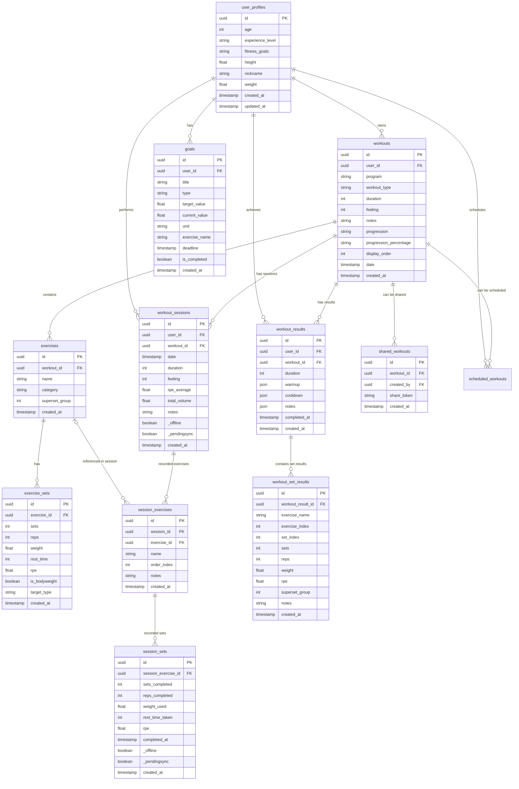

# Supabase Database Schema - SportVault

Tämä tiedosto sisältää kuvauksen SportVault-sovelluksen tietokantarakenteesta ja sen suhteista.

## ER-kaavio (Entity-Relationship Diagram)

## Taulut ja niiden vastuut

### Käyttäjät ja Profiilit

- **user_profiles**: Tallentaa käyttäjän biometriset tiedot (pituus, paino, ikä) ja kuntotason.

### Ohjelmat ja Harjoitukset (Malleja)

- **workouts**: Harjoituspohjat tai yksittäiset harjoitukset, jotka sisältävät useita liikkeitä.
- **exercises**: Harjoitukseen kuuluvat liikkeet.
- **exercise_sets**: Liikkeeseen määritellyt tavoitesarjat (toistot, painot, lepoajat).

### Suoritukset (Sessiot)

- **workout_sessions**: Aktiivinen tai suoritettu harjoituskerta, joka perustuu `workouts`-pohjaan.
- **session_exercises**: Sessioaikana suoritetut liikkeet.
- **session_sets**: Sessioaikana suoritetut sarjat ja niiden todelliset arvot.

### Tulokset ja Analytiikka

- **workout_results**: Kooste harjoituksen lopputuloksesta, sisältäen lämmittelyt ja jäähdyttelyt.
- **workout_set_results**: Tarkemmat tiedot jokaisesta suoritetusta sarjasta analytiikkaa varten.
- **goals**: Käyttäjän asettamat tavoitteet (esim. max paino tietyssä liikkeessä tai workout-määrä).

### Jakaminen

- **shared_workouts**: Mahdollistaa harjoitusohjelmien jakamisen muiden käyttäjien kanssa `share_tokenin` avulla.
